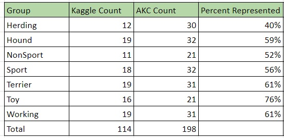
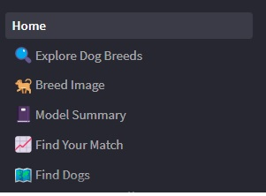
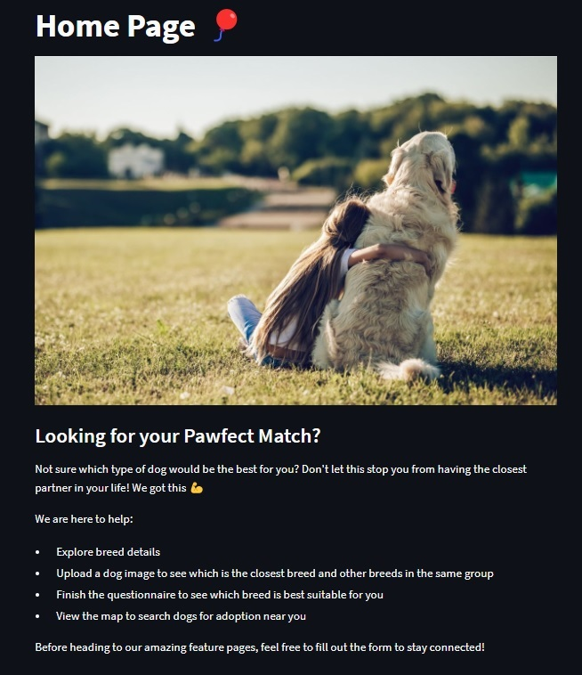
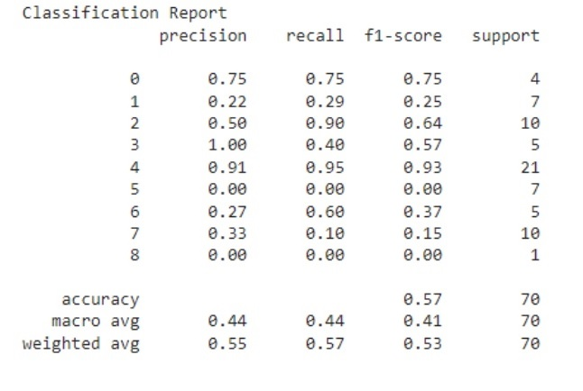

#### UC Berkeley Data Analytics Boot Camp

### Project 4 – Focus on Machine Learning

## Group 7: Bijoyeta Kayal, Chanelle Gonzalez, Crimson Amaro, Noureddine Belhaj, Sanjana Islam, Sherry Ma, Tristan Marcum

# Repository Link: https://github.com/TinTesla/Project_4---Group_7

# Application Link: https://awesome-pawsome.streamlit.app/

### Title: “Pawfect Match” ------------------------------------------------

# Project Overview: Using various machine learning models and data sets, we can help people find the perfect dog using the convenient and user-friendly web application. We have built models to predict and recommend dog breeds based on both an image recognition and a user characteristic selection/ input. To round out the application, we can compare dogs by their characteristics and have a map to help locate dogs/ shelters near you. We can also store user data for updates.

# Data Overview: 
-	Kaggle for images used in the image recognition modeling: https://www.kaggle.com/competitions/dog-breed-identification/data 
-	American Kennel Club (AKC) for breed features data frame and images for display in application: https://github.com/tmfilho/akcdata
-	The AKC data frame includes 277 rows with breed names and 13 columns that are a mix of numerical and categorical values. Feature set list: popularity, group, min and max height, weight, expectancy, grooming frequency, shedding, energy level, trainability, and demeanor.
- Basic cleaning was needed to correct for some inconsistancies
- Sampling bias by group was noticed in the Kaggle data set.

# Models Overview: Please find more information below on all the models used, including: Convolutional Neural Networks, Random Forest, Decision Trees, and more Neural Networks

# Application Overview: We decided on Streamlit for our user interface. It was simple to layout and straight forward to load the models and code… for the most part.  The page outline of the application is as follows:
-	Home Page 
    - Overview of application layout and functionality
    - User Capture Form
-	Explore Dog Breeds
    - User selects breed to explore and is provided with corresponding breed image, features and radar plot comparing breed features to averages of the dog group.
-	Breed Image Detection
    - User uploads image and CNN model projects closest matching breed. The page also provides five similar breeds with images and features. Overall accuracy of 86%. 
-	Model Summary 
    - Provides detailed performance statistics of the breed image model.
-	Find Your Match by Feature Selection
    - User selects preferred feature ranges from a sliding scale and is provided best projection of group and/ or breed. Overall accuracy of 57% by breed and 100% by group. 
-	Find Dogs
    - Map with nearby animal shelters based on the user’s selected location.

# Results Overview: Both models were very successful in predicting an accurate dog match. 
-	Match by Image - Accuracy varies by image, but overall, we reached an 86% accuracy score.
-	Match by Selected Features – We reached overall accuracy of 57% by breed prediction and 100% by group prediction. 

# Future Plans Overview: This application has limitless options for future development. Plans are, but not limited to:
-	Expanding on Shelter options, more details, allowing for shelters to connect and provide details on their adoptable pets.
-	Social options for users to share, connect and be alerted to dogs near them.
-	Additional dog breed features like health issues, cost, etc… 

#### Streamlit Application Setup --------------------------------------

## To run the merged code in local - please follow the folder structure and the installations in python environment  required prior to running the streamlit UI. Installation packages are provided in the requirements.txt.
- **Python version of 3.8 was used inorder to work with Keras and Inception V3 in conjunction.** 
- Download Project directory from GitHub: Awesome-Pawsome
- Install dependencies using the command - `` pip install -r requirements.txt ``
- Start the application using the command - `` streamlit run .\Home.py --server.port 8080 ``

#### Deep-Dive into each model ----------------------------------------

### 1 - Find Your Match by Image Upload 

## Link to test, train, validation and google colab notebook for Model building - -[DogImageClassification](https://drive.google.com/drive/folders/1E9HD6fCRWSloHVMfYOIuKlhGHSldBQbp?usp=sharing) 

## Model Workflow: 

## Summary:
- Image Detection App(Breed Image page) begins with simple task of uploading a dog picture,the prediction model detects the Breed for you and displays on the page only if the prediction % is greater than 40.
- Once the Breed is predicted with accuracy > 40% , the app then fetches the related information of the breed available in our pre-loaded database for breed details and images webscrapped from American Kennel Club site. 
- Alongside, using cosine similarity method, the app displays the top 5 breeds based on traits belonging to the same breed group(Hound/Toy/Terrier etc) as the Predicted Breed Group. 

# Data Preparation:
- Loading AKC cleaned data into dogdata.db(SQLite database) - DBloader.py
- ETL program (TrainTestDataPrep.py) to map the images to labeled dataset and splitting data into Test and Train where each subfolder represents a breed class containing images of that breed. 
- ValidationDataPrep.py prepares the folders for validation downsized to 10 images per class. 

# Model Training/Compilation
- Multiclass classification - Supervised Learning
- Using Inception V3 as the base model, the feature maps were fed forward into a fully connected network of global spatial average pooling layer and Dense layers to build a custom model trained with around 8500 dog breed images. 
- We used a dataset of 10500 breed images having a 120 classes, or labels, divided into 75% of training images(8500) and 25% of test and validation samples. 
- Model building steps - 
    1. Loading the inception model without the top layer/output
    2. Setting the layers of the model as untrainable.
    3. Creating a base model with the inception model output
    4. Adding a global spatial average pooling layer. This addition of layer helps with reducing the dimensionality.
    5. Adding a Dense layer for feeding forward the features
    6. Using softmax as activation function for model compilation
    7. Merging the Dense layer over the base model
    8. ImageDataGenerator reads the training and test images and performs a series of transformations.
    9. Transformations on images: 
        - Rescale
        - Rotate
        - Width shifting
        - Horizontal flip etc 
    10. flow_from_directory method in Keras - feeds the transformed images in batch size of 16 and target image size of 299,299 - **Please note: Training and Test images must be organized in sub folders, where each sub folder represents the class of the image.**
    11. Creating a Model Checkpoint to save the best model and capturing the training history, class labels and evaulation results into a json. 
    
# Model Optimization/Hyperparameter tuning: 
  - Two separate models were trained based on the hyperparameter combinations below:
    1. SGD(Stochastic Gradient Descent) optimizer and learning rate 0.01
    2. Adam optimizer and learning rate 0.001 
    3. Number of epochs: 15
    4. Adam optimized model: dog_model_v_1692053802.h5
    5. SGD optimized model: dog_model_v_1692063030.h5

- Comparison of both optimized models: 
    - Both the models reached highest accuracy at 8/9th epoch. 
    - As compared to Adam optimized model where accuracy was 83%, SGD optimized model reached an accuracy of 86%. 

# Model Validation: 
- A sample size of 10 images per 120 breed class was used to validate both the models where the following results were capture: 
- Prediction outcome per breed(bar chart) showing how many images per breed were a match and no match with the expected breed. 
- Prediction misses -a heatmap matrx - displaying the instances where both model makes mistakes in indentifying the correct breed as expected.  
- While both the models made incorrect predictions for a handful of species(Great Dane, Pyrenees, Swiss Mountain Dog, Huskies.. ), the Adam optimized model was observed to have made incorrect predictions for some more breeds. 
- The Validation accuracy and loss reduction curves were smoother than in case of SGD optimized model as compared to Adam optimized one which had more spikes. 

# Conclusion, We chose SGD optimized model for the application with 86% of accuracy in Prediction. 

## 2 - Find Your Match by Feature Selection 
We needed a multiclass type of prediction for the models. 

# Data Preparation: 
The first step of this modeling was to generate synthetic data to train the model especially for the breed prediction. The original dataset contained 277 lines and each breed appeared one single time in the dataset. We generated additional data using: 

    1. Sample method - df.sample(frac = 100,replace=True) on the dataset to generate additional rows.
    2. Applied feature set changes to show different values. For example, minimum height was changed throughout the whole dataset with random values while keeping consistency of the data and the new value has to be below max height.

We also tried alternative options for scaling methods for the feature set, including: Standard, MinMax, Robust Scaler, Power and Quantile Transformer.

 # Model Optimization: 
 We utilized Hyperparameter Tuning, as well. As we found, Random Forest has several hyperparameters that can be tuned to optimize its performance, such as:

    - n_estimators: The number of decision trees in the forest.
    - max_depth: The maximum depth of each decision tree.
    - min_samples_split: The minimum number of samples required to split an internal node.
    - min_samples_leaf: The minimum number of samples required to be at a leaf node.

# Model Validation:
We tried several different modeling options and our initial attempts yielded an accuracy was 0%. This is normal, as the model was testing on data it never was exposed to. We received satisfactory results using Random Forest and Decision Tree modeling. However, we also tried neural network modeling to see if we can improve on the accuracy by introducing layers and dropping normalization, however the results remained the same. Ultimately, the Random Forest model gave the best accuracy for group and breed prediction.     

# Conclusion, the classification report for breed prediction shows accuracy at 57%. Group prediction accuracy came at 100% which raised some concerns of overfitting. In addition to the testing data set, we also performed extensive sampling based on user input parameters. 

