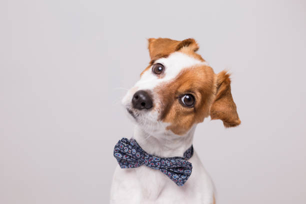

## PAWFECT MATCH
## Project 4 > Group 7

### Home Page
- Basic Overview
- User Questionaire

### Explore Dog Breeds
- Database plotted based on % of max Value per Column
- Image + Stats based on the selected dog breed

### Breed Image 
- Image detection based on user-uploaded image
- Outputs best guess of breed 

### Model Summary
- Stats of the ML models in use

### Find Your Match (Beta)
- Provides breed based on user-defined ranges

### Find Dogs
- Provides Map with nearby animal shelters based on the user's location
