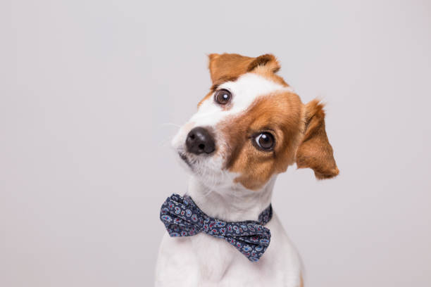

## PAWFECT MATCH
## Project 4 > Group 7

# Streamlit Application Setup
​
##### To run the merged code in local - please follow the folder structure and the installations in python environment  required prior to running the streamlit UI. Installation packages are provided in the requirements.txt.
- **Python version of 3.8 was used inorder to work with Keras and Inception V3 in conjunction.** 
- Download Project directory from GitHub: Cloud
- Install dependencies using the command - `` pip install -r requirements.txt ``
- Start the application using the command - `` streamlit run .\Home.py --server.port 8080 ``
​
##### Link to test, train, validation and google colab notebook for Model building - -[DogImageClassification](https://drive.google.com/drive/folders/1E9HD6fCRWSloHVMfYOIuKlhGHSldBQbp?usp=sharing) 
​
### Model Workflow: 

​
# Dog Image Classification & Breed recommendation- 
- Image Detection App(Breed Image page) begins with simple task of uploading a dog picture,the prediction model detects the Breed for you and displays on the page only if the prediction % is greater than 40.
- Once the Breed is predicted with accuracy > 40% , the app then fetches the related information of the breed available in our pre-loaded database for breed details and images webscrapped from American Kennel Club site. 
- Alongside, using cosine similarity method, the app displays the top 5 breeds based on traits belonging to the same breed group(Hound/Toy/Terrier etc) as the Predicted Breed Group. 
### Data Preparation- 
- Loading AKC cleaned data into dogdata.db(SQLite database) - DBloader.py
- ETL program (TrainTestDataPrep.py) to map the images to labeled dataset and splitting data into Test and Train where each subfolder represents a breed class containing images of that breed. 
- ValidationDataPrep.py prepares the folders for validation downsized to 10 images per class. 
​
### Model Training/Compilation
- Multiclass classification - Supervised Learning
- Using Inception V3 as the base model, the feature maps were fed forward into a fully connected network of global spatial average pooling layer and Dense layers to build a custom model trained with around 8500 dog breed images. 
- We used a dataset of 10500 breed images having a 120 classes, or labels, divided into 75% of training images(8500) and 25% of test and validation samples. 
- Model building steps - 
    1. Loading the inception model without the top layer/output
    2. Setting the layers of the model as untrainable.
    3. Creating a base model with the inception model output
    4. Adding a global spatial average pooling layer. This addition of layer helps with reducing the dimensionality.
    5. Adding a Dense layer for feeding forward the features
    6. Using softmax as activation function for model compilation
    7. Merging the Dense layer over the base model
    8. ImageDataGenerator reads the training and test images and performs a series of transformations.
    9. Transformations on images: 
        - Rescale
        - Rotate
        - Width shifting
        - Horizontal flip etc 
    10. flow_from_directory method in Keras - feeds the transformed images in batch size of 16 and target image size of 299,299 - **Please note: Training and Test images must be organized in sub folders, where each sub folder represents the class of the image.**
    11. Creating a Model Checkpoint to save the best model and capturing the training history, class labels and evaulation results into a json. 
    
### Model Optimization/Hyperparameter tuning: 
  - Two separate models were trained based on the hyperparameter combinations below:
    1. SGD(Stochastic Gradient Descent) optimizer and learning rate 0.01
    2. Adam optimizer and learning rate 0.001 
    3. Number of epochs: 15
    4. Adam optimized model: dog_model_v_1692053802.h5
    5. SGD optimized model: dog_model_v_1692063030.h5
​
- Comparison of both optimized models: 
    - Both the models reached highest accuracy at 8/9th epoch. 
    - As compared to Adam optimized model where accuracy was 83%, SGD optimized model reached an accuracy of 86%. 
​
### Model Validation: 
- A sample size of 10 images per 120 breed class was used to validate both the models where the following results were capture: 
- Prediction outcome per breed(bar chart) showing how many images per breed were a match and no match with the expected breed. 
- Prediction misses -a heatmap matrx - displaying the instances where both model makes mistakes in indentifying the correct breed as expected.  
- While both the models made incorrect predictions for a handful of species(Great Dane, Pyrenees, Swiss Mountain Dog, Huskies.. ), the Adam optimized model was observed to have made incorrect predictions for some more breeds. 
- The Validation accuracy and loss reduction curves were smoother than in case of SGD optimized model as compared to Adam optimized one which had more spikes. 
​
### We chose SGD optimized model for the application with 86% of accuracy in Prediction. 
